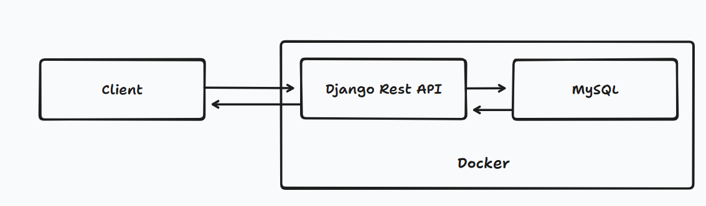

# Zinc Assignment Design Document

## 1. High-Level Architecture Diagram

- All components run in Docker containers.
- CI/CD pipeline runs in GitHub Actions.

---

## 2. API & Data Model Sketch

### API Endpoints
- `GET /api/import-sales/` — Import sales from CSV in static folder
- `GET /api/metrics/revenue/?start=YYYY-MM-DD&end=YYYY-MM-DD` — Revenue metrics
- `GET /api/metrics/revenue/daily/?start=YYYY-MM-DD&end=YYYY-MM-DD` — Daily revenue metrics
- `GET /health` - Check mysql connection
### Data Models
- **Sale**: `date`, `order_id`, `amount_sgd`, `product_id`, `imported_file (FK)`
- **ImportedFile**: `filename`, `imported_at`, `num_rows`, `status`, `error_message`

---

## 3. Infrastructure Choices
- **Backend**: Django REST Framework (Python)
- **Database**: MySQL 8 (Docker container)
- **Containerization**: Docker, Docker Compose
- **CI/CD**: GitHub Actions
- **Logging**: JSON logs via python-json-logger
- **Testing**: Django TestCase, APIClient

---

## 4. Scaling & Resilience Strategy
- **Stateless API**: Multiple Django containers can be run behind a load balancer.
- **Database**: MySQL can be clustered or use managed service for HA.
- **Storage**: Use Docker volumes for persistent data; consider S3 for static/CSV in production.
- **Health Checks**: Docker healthchecks for both MySQL and Django.
- **Graceful Rollout**: Blue/green or rolling deployments with Docker Compose or Kubernetes.

---

## 5. CI/CD & Rollback Plan
- **CI**: On push to main, GitHub Actions builds, runs migrations, and tests Docker image.
- **CD**: (Optional) Deploy to staging/production on successful CI.
- **Rollback**: Revert to previous image/tag and re-run migrations if needed.
- **Migration Safety**: Use Django's migration system; backup DB before major changes.

---

## 6. Observability & SRE
- **Logging**: All API and system logs in JSON for easy parsing and aggregation.
- **Health Endpoints**: `/health` for liveness/readiness.
- **Metrics**: API exposes revenue metrics; can be extended for Prometheus.
- **Alerting**: Integrate with log/metric aggregation tools (e.g., ELK, Grafana, Sentry).

---

## 7. Trade-Off Discussion
- **Simplicity vs. Flexibility**: Docker Compose is simple for local/dev, but Kubernetes is better for large scale.
- **MySQL vs. Postgres**: MySQL chosen for compatibility, but Postgres offers more features for analytics.
- **Pydantic Validation**: Adds type safety, but increases complexity slightly.
- **Non-root Docker User**: Improves security, but may require extra file permission management.
- **Bulk Import**: Fast, but may skip row-level validation; can be extended for more robust error handling.
- **Logging**: JSON logs are machine-friendly, but less human-readable; can be parsed by log aggregation tools. 